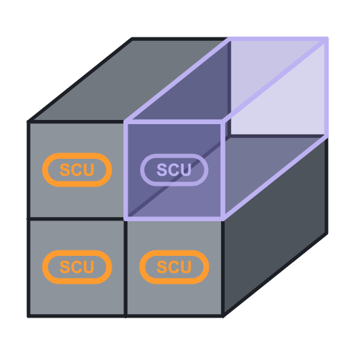
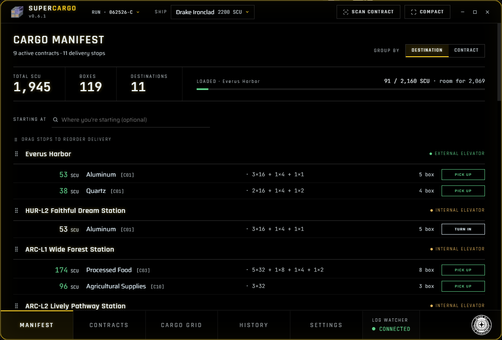
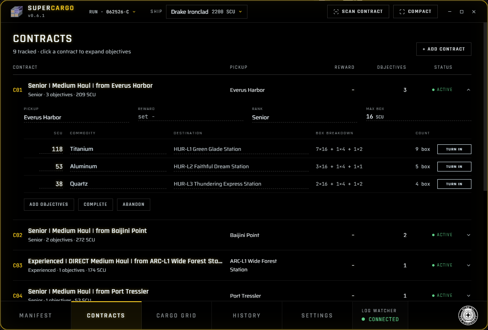
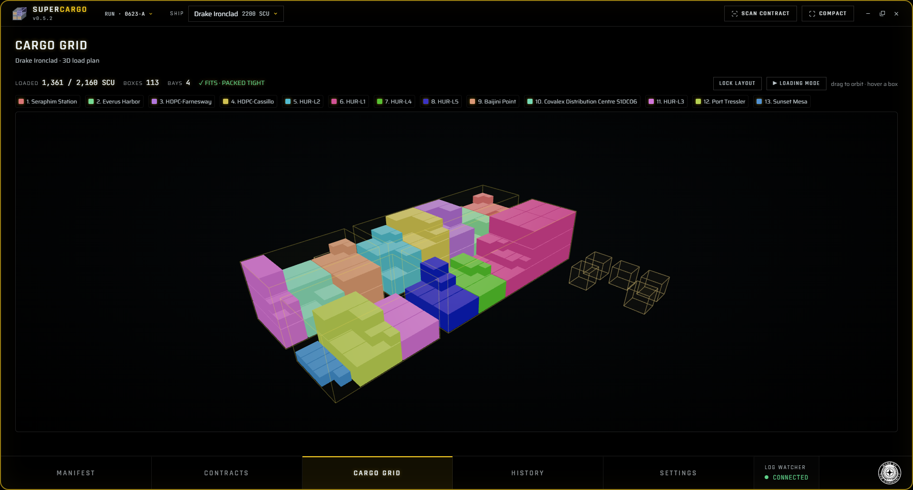
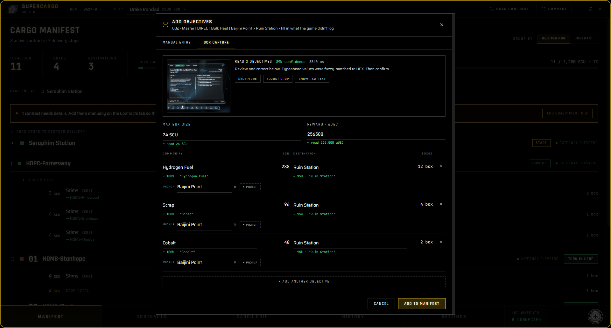
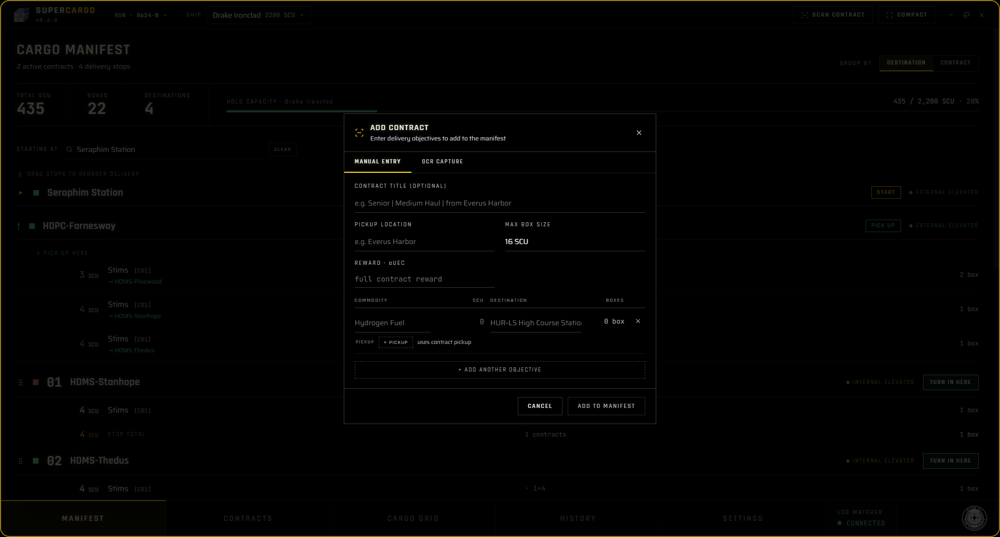

#  SuperCargo

A desktop app for Star Citizen haulers who stack a pile of contracts into one run.
It pulls everything into a single manifest: box-size math, a route that orders your
stops, a 3D loading guide, and per-run earnings, all in a holographic mobiGlas-style
interface.

## Download

Grab the latest build from the [Releases page](https://github.com/AquatikJustice/SuperCargo/releases).

- **Windows installer** (`SuperCargo-Setup-*.exe`) installs and auto-updates.
- **Windows portable** (`SuperCargo-Portable-*.exe`) is a single exe with no install.
- **Windows zip** (`SuperCargo-*-win.zip`) is the unpacked folder, drop it wherever.
- **Linux** (`SuperCargo-*.AppImage`) make it executable and run it (see Linux notes below).

The builds are not code-signed, so Windows SmartScreen may warn you on first run. Click
"More info", then "Run anyway".

### Linux notes

The Linux AppImage is **new and untested**, so treat it as experimental for now.

1. Make it executable: `chmod +x SuperCargo-*.AppImage` (or right-click, Properties, Allow executing).
2. Run it by double-clicking, or from a terminal: `./SuperCargo-*.AppImage`.
3. If it will not start, install FUSE: `sudo apt install libfuse2` on Debian/Ubuntu, or your
   distro's equivalent.

If you hit problems, please open an issue with your distro and what happened.

## Features

- **Automatic Contract Tracking.** Picks up hauling contract accepts, objectives, completions,
  and abandons as they happen.
- **Manifest.** Every active contract's cargo in one place, grouped by destination or by
  contract, with per-stop SCU and box totals and a color-coded hold-capacity bar.
- **Loading Mode.** Follows your route and tells you what to load at each pickup, where to put it
  on your ship, and what to drop along the way, so a multi-pickup run turns into a checklist.
- **Route optimization.** Orders your stops to cut down on travel. Drag to override whenever you
  want.
- **3D cargo grid and loading guide.** A packed view of your hold plus a per-stop walkthrough of
  what to pull from the freight elevator, in load order.
- **OCR capture.** Reads the mobiGlas contract screen to fill in objectives, max box size, and
  reward for you to confirm before it lands on the manifest.
- **Edit anything.** Change a contract after you add it. Pickup, reward, rank, max box size, and
  each objective's commodity, amount, and destination are all editable inline.
- **Turn-in tracking.** On submit, record a full, partial, or no turn-in per stop, including
  partial payouts and the reputation line.
- **Runs and history.** Work is grouped into runs. One trip is one run. History keeps each run's
  contracts and earnings.
- **Compact overlay.** A small always-on-top "next stop" card you can pin over the game.
- **Bundled game data.** Ships, freight locations, and commodities come with the app.
- **StarStrings compatible.** When it's present, blueprint chances and reputation show up.

## Screenshots

The cargo manifest, grouped by destination:

Every accepted contract, with inline editing for anything the log did not give you:

The 3D cargo grid, color-coded by destination:

Reading a contract screen with OCR:

Or just add one by hand:

## Requirements

- Windows or Linux
- Star Citizen installed

## Credits

Community data sources: [UEXcorp](https://uexcorp.space) (ships, commodities, locations,
distances), [sc-cargo.space](https://sc-cargo.space) and [Ratjack](https://ratjack.net/Star-Citizen/Cargo-Grids/)
(cargo-grid layouts), and [scunpacked](https://github.com/StarCitizenWiki/scunpacked-data)
(datamined reference). Thank you.

> ### Star Citizen - Made by the Community
>
> SuperCargo is an **unofficial** Star Citizen community tool. It is **not** endorsed by,
> sponsored by, or affiliated with Cloud Imperium Games or Roberts Space Industries.
>
> Star Citizen®, Squadron 42®, Roberts Space Industries®, and Cloud Imperium® are registered
> trademarks of Cloud Imperium Rights LLC. All game content and related marks are the property
> of Cloud Imperium Rights LLC and Cloud Imperium Rights Ltd. See the
> [Star Citizen Fankit](https://robertsspaceindustries.com/en/fankit) and the Fankit & Fandom
> FAQ for community-use guidelines.
>
> The **"Made by the Community"** badge is an official Fankit asset, included under those
> guidelines in [`assets/MBTC-logos/`](assets/MBTC-logos/) (the app loads it from
> `src/renderer/public/made-by-community.png`). The Settings -> ABOUT panel always shows the
> text attribution above.
